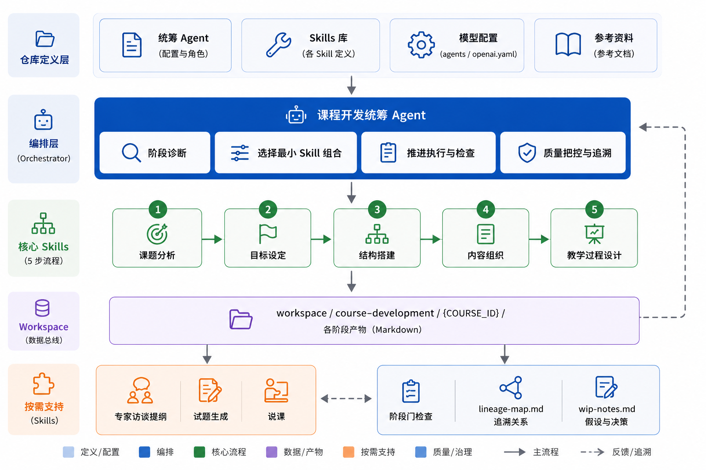

# Course Development Skills



这是一套用于企业培训课程开发的 Codex skills 和统筹 Agent，核心流程遵循课程开发 5 步法：课题分析、目标设定、结构搭建、内容组织、教学过程设计。专家访谈提纲设计、试题生成和说课作为按需使用的支持能力。

它的核心原则是：课程开发必须从业务问题和学员工作场景出发，而不是从已有资料目录或讲师想讲的内容出发。每个 skill 都要求产出能追溯到课程目标、学员痛点、工作任务和可观察的学习证据。

## Skills Overview

| 类型 | Skill | 中文名称 | 主要用途 | 典型产出 |
| --- | --- | --- | --- | --- |
| 核心 1 | `topic-analysis` | 课题分析 | 判断课题是否适合做成课程，明确业务目标、学员对象、工作场景、绩效差距、KAS 内容地图和课程边界 | 课题分析简报、KAS 内容地图、范围边界、课程启示 |
| 核心 2 | `course-objectives` | 目标设定 | 把模糊培训意图转化为可观察、可衡量、可评估的课程目标 | 课程目标组、目标类别/水平、KAS 映射、评估证据 |
| 核心 3 | `course-structure` | 结构搭建 | 把目标、任务和素材整理为清晰的课程模块、层级和逻辑顺序 | 一级/二级模块表、承接逻辑、内容取舍 |
| 核心 4 | `content-organization` | 内容组织 | 根据目标和结构筛选、归类、裁剪和排序课程内容 | 内容取舍表、内容分类表、模块内容组织表、案例/练习建议 |
| 核心 5 | `process-design` | 教学过程设计 | 把课程内容转化为可授课的流程、活动、时间分配、讲师/学员动作和学习衡量 | 总体流程、模块过程表、活动设计表、开场导入、讲师引导 |
| 按需 | `expert-interview-outline` | 专家访谈提纲设计 | 从专家那里萃取课程所需经验、案例、难点、方法和工具素材 | 访谈提纲、STAR 追问话术、核心必问/拓展选问问题 |
| 按需 | `quiz-generation` | 试题生成 | 根据课程目标、核心内容和重难点生成课后考试题或随堂测试题 | 试卷说明、试题、答案解析、目标/知识点标注 |
| 按需 | `course-briefing` | 说课 | 面向评审专家、业务负责人、培训管理者或讲师团队说明课程设计逻辑和亮点 | 说课结构、完整说课稿、设计亮点、答辩准备 |

## Orchestrator Agent

本仓库提供一个课程开发统筹 Agent，参考 POMASA 的“Blueprint + 阶段流水线 + 文件数据总线 + 可追溯产物”思路设计：

```text
.agents/agents/course-development-orchestrator.md
```

它的角色是主动判断当前课程开发阶段，并选择合适的 skill 组合推进工作。适合在用户只给出模糊需求、零散材料、专家经验或课程草稿时使用。

Agent 会在完整课程开发任务中维护运行工作区：

```text
workspace/course-development/{COURSE_ID}/
├── 00.project-brief.md
├── 01.topic-analysis.md
├── 02.course-objectives.md
├── 03.course-structure.md
├── 04.content-organization.md
├── 05.process-design.md
├── support.expert-interview-outline.md
├── support.quiz-generation.md
├── support.course-briefing.md
├── lineage-map.md
└── wip-notes.md
```

其中 `lineage-map.md` 用于维护目标、模块、内容、活动，以及按需生成的访谈问题、试题和说课要点之间的追溯关系。

Agent 会按下面逻辑统筹：

- 只有主题或培训需求：先调用 `$topic-analysis`
- 课题边界清楚但目标模糊：调用 `$course-objectives`
- 目标稳定但结构未定：调用 `$course-structure`
- 已有结构和素材：调用 `$content-organization`
- 内容稳定需要授课流程：调用 `$process-design`
- 需要专家经验：调用 `$expert-interview-outline`
- 需要学习评估：调用 `$quiz-generation`
- 需要说课或课程评审汇报：调用 `$course-briefing`

它不会机械调用全部 skill，而是根据当前任务选择最小但足够的组合；调用 skill 时也不会用自己的摘要替代 skill，而是以对应 `SKILL.md` 的完整规则为准。

## Recommended Workflow

课程开发主流程固定为 5 步：

```text
课题分析 -> 目标设定 -> 结构搭建 -> 内容组织 -> 教学过程设计
```

对应 skill：

```text
$topic-analysis
  -> $course-objectives
  -> $course-structure
  -> $content-organization
  -> $process-design
```

按需支持能力根据任务插入或追加：

```text
专家访谈提纲设计：通常在结构搭建后、内容组织前使用
试题生成：通常在目标、内容和教学过程稳定后使用
说课：通常在核心五步完成后，用于课程评审、汇报或讲师试讲前说明
```

## What Each Skill Needs

### 1. `$topic-analysis`

用于课程开发前的课题判断和边界澄清。

适合输入：

- 初步课程主题或培训需求
- 业务背景、质量问题、项目问题或绩效问题
- 目标学员、岗位、工作任务
- 现有资料、制度、流程、案例

关键判断：

- 这个问题是否适合用培训解决
- 学员真正需要改变的行为是什么
- 课程应该覆盖什么、排除什么
- 课程更像独立课程、模块课程、材料说明，还是非培训问题

### 2. `$course-objectives`

用于把课题分析结果转成可衡量课程目标。

目标默认使用：

```text
对象 + 条件 + 动作 + 内容 + 标准
```

重点校准：

- 目标是否从学员视角表达
- 动作是否可观察
- 是否区分知识、技能、态度目标
- 是否能对应评估证据
- 是否适配课程时长和教学方式

### 3. `$course-structure`

用于搭建课程骨架。

可选结构逻辑：

- 流程型：按工作步骤或项目阶段展开
- 要素型：按能力要素、标准维度或关键要素展开
- WWH：按为什么、是什么、怎么做展开
- 案例问题型：围绕典型问题或案例推进
- 任务练习型：围绕递进任务或产出推进

结构质量要求：

- 模块必须服务课程目标和工作任务
- 不照搬资料目录
- 不把教学活动当成内容模块
- 每个模块要有清楚的承接关系

### 4. `$content-organization`

用于把资料、经验、制度、案例和零散素材整理成可教学内容。

内容处理方式：

- 必讲：没有它学员无法达成目标
- 必练：对应技能、判断或迁移应用
- 可选：可压缩、下沉为预习或附录
- 排除：不服务目标或工作场景

内容组织重点：

- 区分通用原理、实践经验、操作方法、案例素材、练习任务和工作启发
- 建立“是什么 -> 为什么 -> 怎么做”或“是什么 -> 有什么 -> 怎么做”的表达逻辑
- 每个关键内容都要连接真实工作应用

### 5. `$process-design`

用于把稳定的内容转化为课堂流程和教学活动。

它覆盖两类任务：

- 完整教学过程设计：模块流程、教学策略、活动安排、练习反馈、时间分配
- 课程开场导入设计：AIDA、课程开场五步法、讲师话术、课堂公约和课程结构介绍

过程设计原则：

- 知识内容要有确认
- 技能内容要有练习
- 态度内容要有表达、选择或承诺
- 核心练习必须有反馈
- 每 15-25 分钟应有学习动作变化
- 开场要完成期望值管理、注意力管理和学习动机管理

课程开场五步法：

```text
问好 + 介绍 -> 导入主题 -> 分组/破冰 -> 公约 + 目标 -> 课程结构
```

### 按需：`$expert-interview-outline`

用于访谈业务专家、岗位高手、流程负责人或一线骨干，萃取课程开发素材。

使用前应准备：

- 最终版课题分析表
- 最终版课程目标
- 最终版课程结构

访谈逻辑：

```text
课题分析定痛点 -> 课程目标定方向 -> 课程结构定框架 -> 访谈提纲定聚焦
```

访谈 7 步：

```text
说明目的 -> 分享事件 -> 提炼经验 -> 深挖难点 -> 提出方法 -> 收集例子 -> 表达感谢
```

核心问题会配套 STAR 追问：

```text
Situation 情境 -> Task 任务 -> Action 行动 -> Result 结果
```

### 按需：`$quiz-generation`

用于生成课后考试题、随堂测试题、答案解析或题库内容。

正式试卷需要输入：

- 课程完整主题
- 最终版课程目标
- 核心教学内容与重难点
- 学员高频易错点
- 试卷题量、题型、分值和考试时长

默认命题规则：

- 核心知识点、关键技能点、高频易错点题量不少于 70%
- 难度比例：基础 60%、进阶 30%、拔高 10%
- 知识类目标用客观题检验记忆和理解
- 技能类目标用案例题、情景题检验应用
- 态度类目标用场景判断题检验认知和价值取向
- 每题必须有答案、解析、对应目标/知识点和难度标注

### 按需：`$course-briefing`

用于生成说课稿、课程设计汇报、课程评审说明或讲师试讲前说明。

正式说课建议输入：

- 课题分析结论
- 课程目标
- 课程结构
- 内容组织结果
- 教学过程设计
- 学习评估方案，如有
- 说课对象、场景和时长

默认说课主线：

```text
为什么开这门课 -> 学员要达成什么目标 -> 课程如何搭结构 -> 内容如何支撑目标 -> 教学过程如何促成学习 -> 如何评估效果 -> 课程价值与落地保障
```

它重点说明课程设计逻辑，不是复述课程目录。

## Common Use Cases

### 判断一个课题能不能做成课

使用：

```text
$topic-analysis
```

输入课题、学员对象、业务背景和现有问题，输出课题判断、绩效差距、KAS 内容地图和课程边界。

### 把一个模糊培训需求变成课程目标

使用：

```text
$topic-analysis -> $course-objectives
```

先明确业务场景和学员差距，再写 2-5 条可观察目标。

### 把资料整理成课程大纲

使用：

```text
$course-structure -> $content-organization
```

先定模块结构，再筛选资料、组织内容和提炼表达逻辑。

### 从专家经验开发课程

使用：

```text
$topic-analysis -> $course-objectives -> $course-structure -> $expert-interview-outline -> $content-organization
```

先明确要访谈什么，再用专家访谈补充真实案例、难点处理、常见误区和工作方法。

### 设计可直接授课的课堂流程

使用：

```text
$content-organization -> $process-design
```

把模块内容转成讲师动作、学员动作、练习任务、反馈方式和时间安排。

### 生成课后考试题

使用：

```text
$course-objectives -> $content-organization -> $quiz-generation
```

确保题目能检验课程目标，而不是只考记忆和概念。

### 生成课程说课稿

使用：

```text
$topic-analysis -> $course-objectives -> $course-structure -> $content-organization -> $process-design -> $course-briefing
```

确保说课能讲清课程背景、目标、结构、内容取舍、教学过程、评估闭环和设计亮点。

## Quality Principles

这套 skill 共同遵循以下质量原则：

- 从业务问题出发，不从资料目录出发
- 从学员工作任务出发，不从讲师想讲什么出发
- 目标必须可观察、可评估
- 内容必须服务目标和工作应用
- 结构必须有主线和承接逻辑
- 活动必须有学习目的和衡量证据
- 专家访谈必须围绕痛点、目标和模块
- 试题必须能追溯到课程目标和核心内容
- 可选内容下沉，必达内容优先
- 当输入不足时，明确标注假设，不把推断写成事实

## Repository Layout

```text
.agents/skills/
├── topic-analysis/
├── course-objectives/
├── course-structure/
├── content-organization/
├── process-design/
├── course-briefing/
├── expert-interview-outline/
└── quiz-generation/
```

```text
.agents/agents/
└── course-development-orchestrator.md
```

每个 skill 通常包含：

```text
SKILL.md                 # 核心说明和执行规则
agents/openai.yaml       # Codex UI 展示信息
references/*.md          # 画布、模板、检查清单或详细规则
```

## Update

修改 skill 后，建议先校验再提交：

```bash
python3 /Users/gran/.codex/skills/.system/skill-creator/scripts/quick_validate.py .agents/skills/<skill-name>
git status
git add .agents/skills README.md .gitignore
git commit -m "Update course development skills"
git push
```
